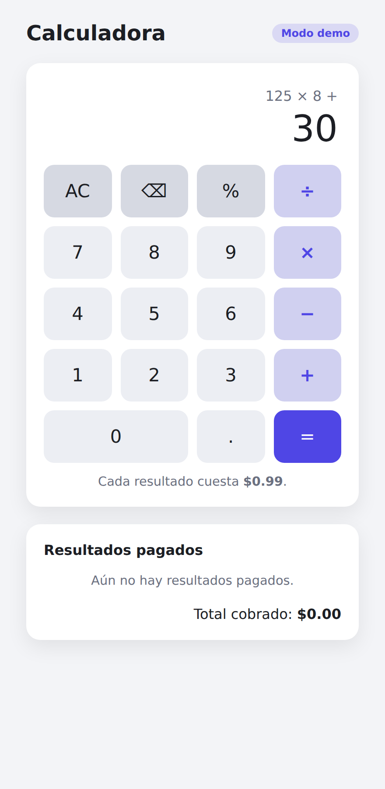
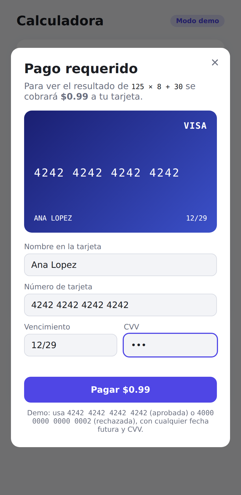
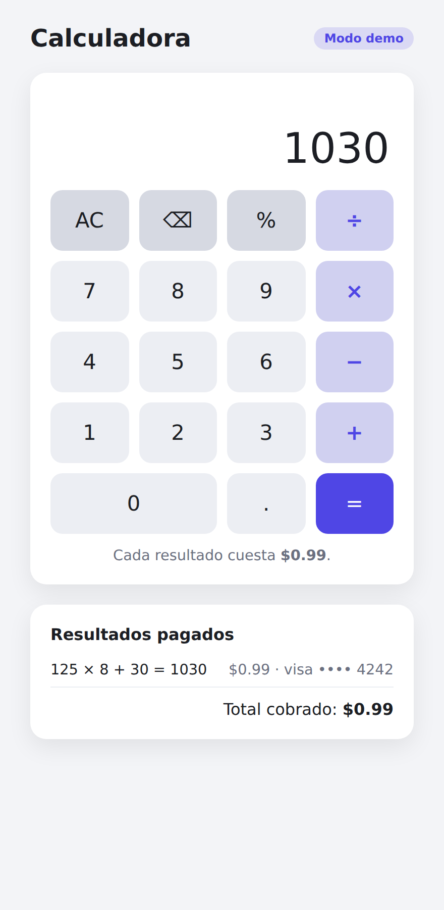

# Calculadora de pago

Calculadora web en la que **cada resultado requiere un cobro con tarjeta**. Al pulsar `=` (o Enter),
el resultado queda bloqueado y se abre un formulario de pago. El resultado solo se muestra cuando
el pago se aprueba.

## Uso

Abre `index.html` en el navegador (no requiere instalación ni servidor).

- Costo por resultado: `FEE` en `app.js` (por defecto $0.99).
- Tarjetas de prueba:
  - `4242 4242 4242 4242` → aprobada
  - `4000 0000 0000 0002` → rechazada
  - Cualquier fecha futura y CVV de 3 dígitos (4 para Amex).
- Teclado: dígitos, `+ - * /`, `.`, `%`, Enter/`=`, Backspace, Esc.

## Estructura

| Archivo | Descripción |
|---|---|
| `calculator.js` | Evaluación de expresiones con precedencia de operadores |
| `payment.js` | Validación de tarjeta (Luhn, vencimiento, CVV, marca) y cobro **simulado** |
| `app.js` | Interfaz: teclado, modal de pago e historial de cobros |
| `tests/run.js` | Pruebas unitarias (`node tests/run.js`) |

## Cobros reales

El cobro actual es una **simulación**: los datos de la tarjeta nunca salen del navegador.
Para cobrar dinero real no recojas el número de tarjeta en tu propio formulario (eso te obliga a
cumplir PCI DSS); usa una pasarela como [Stripe](https://stripe.com/docs/payments/accept-a-payment):

1. Un pequeño backend crea un `PaymentIntent` por el monto de `FEE` con tu clave secreta.
2. En el frontend, sustituye los campos de tarjeta por Stripe Elements y confirma el pago con
   `stripe.confirmCardPayment(clientSecret)`.
3. Reemplaza `Payment.charge()` por esa llamada; el resto de la app no cambia.

## Capturas

| Cálculo | Pago | Resultado |
|---|---|---|
|  |  |  |
